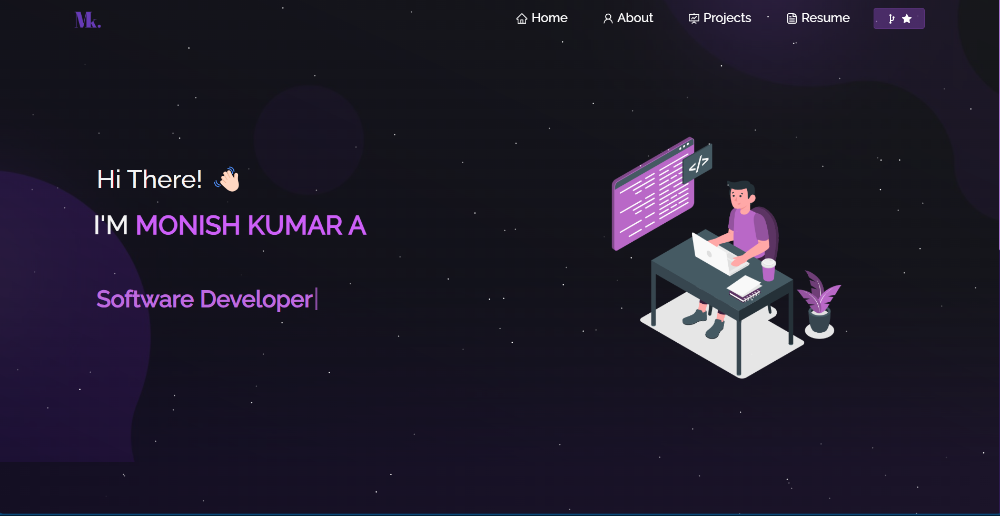
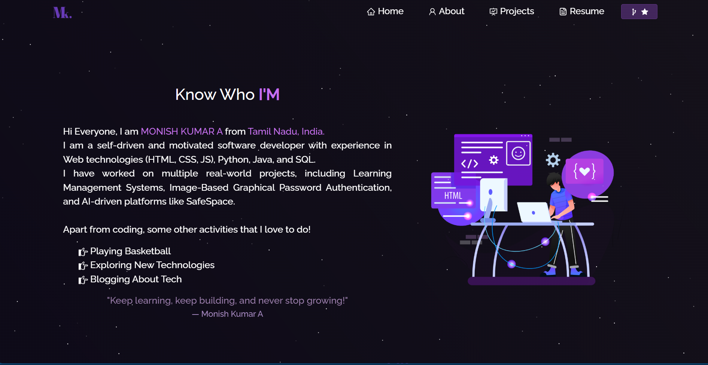

# Monish Kumar's Portfolio Website - v1.0 🚀

### 🔗 [Live Demo](https://imonishkumarportfolio.netlify.app/)  




## 🌟 Introduction

This is my personal portfolio website showcasing my projects, technical skills, and achievements. It includes my resume, GitHub contributions, and an interactive UI built with modern web technologies.

## 🔧 Built With

This project was developed using:

- **React.js** - Frontend framework  
- **Node.js & Express.js** - Backend API  
- **Bootstrap & CSS3** - Styling and responsiveness  
- **VS Code** - Code editor  
- **Vercel / Netlify** - Deployment  

---

## 🚀 Features

✅ **Multi-Page Layout**  
✅ **Fully Responsive & Mobile-Friendly**  
✅ **Dark/Light Theme Toggle**  
✅ **Projects, Resume, and Contact Sections**  
✅ **Downloadable Resume**  
✅ **Optimized for SEO & Performance**  

---

## 🛠 Installation and Setup Instructions

To run this project locally, follow these steps:

### 1️⃣ Clone the Repository
```sh
git clone https://github.com/monishkumar/portfolio.git
